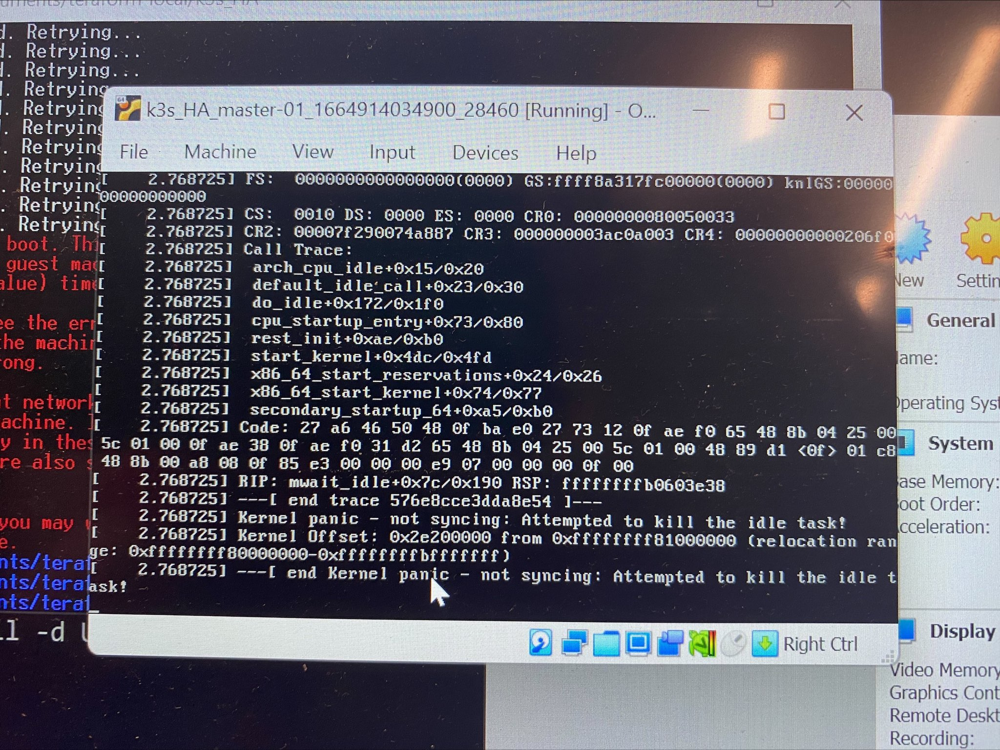
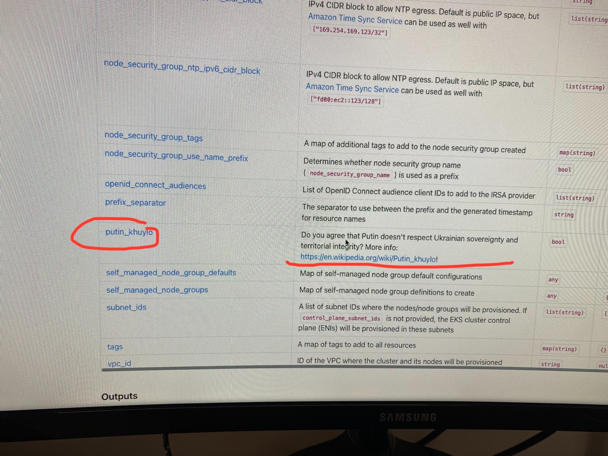
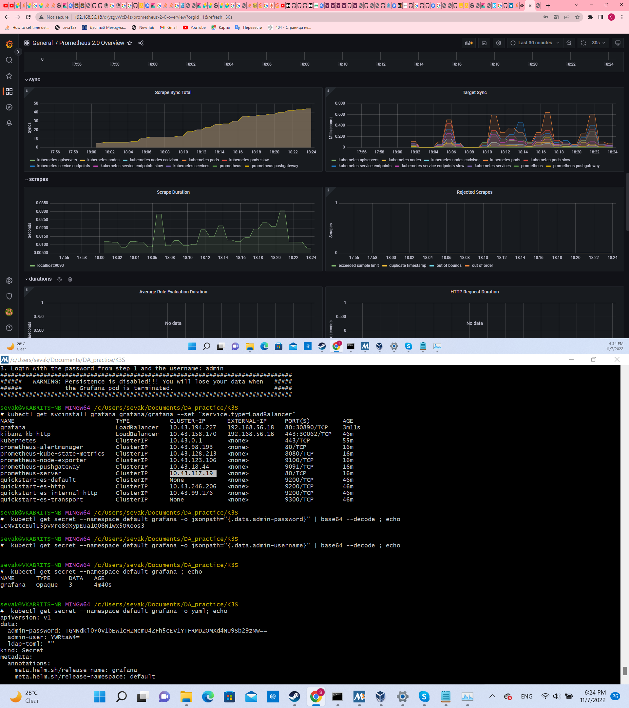
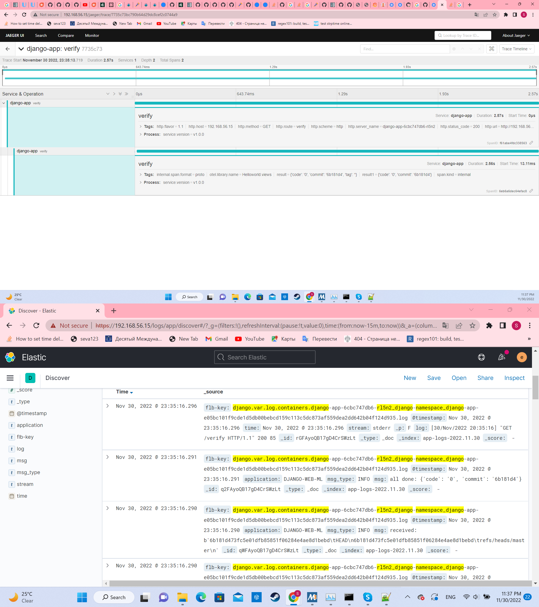

# Проблемы при реализации практики

Prescriptum: Логи написаны с изрядной долей самоиронии и ни в коем случае не преследуют цели кого-то обидеть. Более того, в них исключительно то, что я думаю: если там написано пусть даже и в шуточной форме, что я кого-то уважаю, так оно и есть, а шуточность формы нужна лишь для того, чтобы сделать интересней для читателя выражение этой самой глубокой признательности и уважения.

## K3S HA Vagrant stage

Репозитории проекта: [начальный](https://github.com/skabrits/Teraform-local) (`REGEX: (.*)-Local-stage-Vagrant-K3s-HA/(.*)`) и [отпочковавшийся](https://github.com/skabrits/K3S-HA-Vagrant).

Репозитории сторонних ресурсов:
- [Django App](https://github.com/skabrits/ML_web)
- [DockerHub](https://hub.docker.com/repository/docker/skabrits/django)

Обозначения:
- Значком :warning: помечены те пункты, которые содержат заметные проблемы.
- Значком :radioactive: помечены те пункты, которые содержат наиболее серьёзные проблемы.
- Значком :white_check_mark: помечены те пункты, которые содержат решение проблем из рубрики *__интриги&расследования__*

|        дата         | событие                                                                                                                                                                                                                                                                                                                                                                                                                                                                                                                                                                                                                                                                                                                                                                                                                                                                                                                                                                                                                                                                                                                                                                                                                                                                                                                                                                                                                                                                                                                                                                                                                                                                                                                                                                                                                    |
|:-------------------:|----------------------------------------------------------------------------------------------------------------------------------------------------------------------------------------------------------------------------------------------------------------------------------------------------------------------------------------------------------------------------------------------------------------------------------------------------------------------------------------------------------------------------------------------------------------------------------------------------------------------------------------------------------------------------------------------------------------------------------------------------------------------------------------------------------------------------------------------------------------------------------------------------------------------------------------------------------------------------------------------------------------------------------------------------------------------------------------------------------------------------------------------------------------------------------------------------------------------------------------------------------------------------------------------------------------------------------------------------------------------------------------------------------------------------------------------------------------------------------------------------------------------------------------------------------------------------------------------------------------------------------------------------------------------------------------------------------------------------------------------------------------------------------------------------------------------------|
|  26  сентября   | 
 
 :radioactive: Пытался установить Vagrant, WSL, Terraform на Windows, Vagrant не удалось 
 <ul> <li> Пытался установить vagrant на windows под WSL. </li> <li> В процессе оказалось что необходимо также установить Virtual Box. </li> <li> Оный был как поздее выяснится весьма 'так-себе' совместим с Hyper-V (kernel panic если меньше 2-х ядер и 4 Gb RAM на машинку), без которого не работает уже WSL. Этакий Ураборос. </li> <li> Но до этого я тогда не дошёл, так как wsl был отдельной средой, а vagrant я кажется ставил на windows, поэтому запуская его из под WSL ловил какие-то ошибки [0] про:   :warning: `cmd.exe not found in PATH` </li> </ul> 
                                                                                                                                                                                                                                                                                                                                                                                                                                                                                                                                                                                                                                                                                                                                                                                                                                                                                                                                                                                                                                                                                                              |
|  27  сентября   | 
 
 :warning: Перешёл на MAC 
 <ul> <li> Установил Vagrant на mac </li> <li> :warning: Какие-то смутные проблемы с Vagrant destroy: вроде как не все ноды умирают. Более не встречались, как разрешились не ясно, но вероятно решение было простым. </li> </ul> 
                                                                                                                                                                                                                                                                                                                                                                                                                                                                                                                                                                                                                                                                                                                                                                                                                                                                                                                                                                                                                                                                                                                                                                                                                                                                                                                                                                                                                                                                                                                        |
| 27-30  сентября | 
 
 Работа с кубами на однонодовом кластере 
 <ul> <li> Учусь работать с [кубами](https://github.com/eficode-academy/kubernetes-katas) </li> <li> :warning: Понял что прийдётся расстаться с девушкой </li> </ul> 
                                                                                                                                                                                                                                                                                                                                                                                                                                                                                                                                                                                                                                                                                                                                                                                                                                                                                                                                                                                                                                                                                                                                                                                                                                                                                                                                                                                                                                                                                                                                                                      |
|  30  сентября   | 
 
 :warning: (не)Понимаю принцип работы сервиса 
 <ul> <li> :warning: Удивляюсь почему NodePort service плохо работает при смерти 'ноды подруги матери', хотя ничего удивительного тут нет :upside_down_face: ( или есть?) ) 
 
 если интересуют конкретные детали 
 `Как будет время ответить, есть вопрос по  HA services: я на кластере с 2 worker  и 1 master сделал 8 реплик nginx с сервисом доступным через NodePorts (так как как я понял вариант с LoadBalancer работает только в облаке, а на локалке там вечное pending при получении external IP). Около половины под живут на одной ноде, оставшиеся -- на другой. Когда я убиваю одну поду -- всё работает стабильно. Но когда я убиваю одну ноду с половиной под, секунд 30 вся эта конструкция работает очень нестабильно с перерывами, пока снова не выходит на рабочий режим. Не знаете ли вы в чём дело и спасёт ли от таких проблем ещё 1 worker?` `Подключаюсь я на соответствующий порт мастер-ноды` `Я по curl каждые 500 мс запрашиваю веб страницу с мастера (192.168.56.10:30983) и если все годы работают, то стабильно каждые полсекунды оно мне выводит в консоль веб страницу. Когда я убиваю ноду №1 (на которой по всей видимости хостится активный под, у которого я и запрашивал веб страницу), сначала где-то 2-3 секунды curl не выдаёт ничего, потом снова начинает выдавать веб страницы, но не каждые пол секунды, а раз в произвольное количество времени: может например выдавать 3 раза по пол секунды, а потом с перерывом 5 секунд или 10 раз по про секунды, а потом вдруг перестать выдавать на 10 секунд. И такая фигня длится от 30 до 60 секунд, после чего он снова начинает стабильно выдавать страницу раз в пол секунды` 
 </li> </ul> 
 |
|  1-2  октября   | Выходные                                                                                                                                                                                                                                                                                                                                                                                                                                                                                                                                                                                                                                                                                                                                                                                                                                                                                                                                                                                                                                                                                                                                                                                                                                                                                                                                                                                                                                                                                                                                                                                                                                                                                                                                                                                                                   |
| 30->3  октября  | 
 
 :radioactive: Борюсь за подъём HA K3S 
 <ul> <li> :radioactive: Безуспешно пытаюсь поднять HA K3S кластер по документации Rancher на host-only adapter подсети 192.168.56.* </li> <li> :warning: Это мой первый кластер, не скопированный с инета поэтому не уверен во всём. Попутно безуспешно пытаюсь найти на K3S готовый пример HA чтобы взять его за основу. Безуспешно, так как найденные варианты имеют кучу bash кода назначение которого мне не понятно (тогда у меня было плохо с bash, т.е.) </li> <li> Это первый раз когда тупое гугление в лоб не дало результатов и пришлось несколько раз погуглить разные части логов </li> <li> :warning: Расстался с девушкой </li> </ul> 
                                                                                                                                                                                                                                                                                                                                                                                                                                                                                                                                                                                                                                                                                                                                                                                                                                                                                                                                                                                                                                                                                       |
|   4  октября    | 
 
 :warning: :white_check_mark: Победил HA K3S 
 <ul> <li> :white_check_mark: [Проблема](https://github.com/k3s-io/k3s/issues/1267) была в необходимости (подозреваю из-за host-only адаптера) указать `--node-external-ip` </li> <li> Начались проблемы с маком: спантанно исчезающие 40 Гб на диске из-за icloud </li> <li> :warning: :white_check_mark:/2 Предпринял безуспешную попытку миграции на windows [0] :wink: (вот тут как раз я дошёл до 2 Босса: kernel panic)  </li> </ul> 
                                                                                                                                                                                                                                                                                                                                                                                                                                                                                                                                                                                                                                                                                                                                                                                                                                                                                                                                                                                                                                                                                                                                                                                                                                                                        |
|   5  октября    | 
 
 :warning: Кризис традиционных on-prem external ALB 
 <ul> <li> :warning: Как теперь понимаю, после работы с AWS ALB додумался до создания на NGINX ALB для сервиса типа NodePort, но не смог имплементировать из-за ограничений NGINX по перенаправлению трафика на рандомные порты нод, на которых может появится сервис типа NodePort </li> <li> Сделал NGINX external LB для HA Master Nodes для Api Server (6443 порт) </li> <li> Посему по совету проверенных камрадов и мудрых наставников начал имплементацию MetalLB </li> </ul> 
                                                                                                                                                                                                                                                                                                                                                                                                                                                                                                                                                                                                                                                                                                                                                                                                                                                                                                                                                                                                                                                                                                                                                                                                                                           |
|  8-9  октября   | Выходные                                                                                                                                                                                                                                                                                                                                                                                                                                                                                                                                                                                                                                                                                                                                                                                                                                                                                                                                                                                                                                                                                                                                                                                                                                                                                                                                                                                                                                                                                                                                                                                                                                                                                                                                                                                                                   |
|  5-12  октября  | 
 
 Чистил нычки перед переходом на следующий уровень 
 <ul> <li> Допилил MetalLB </li> <li> Привёл всё в рабочий вид, с тестовым приложением в виде NGINX </li> <li> Вспомнил DJANGO (после 3 лет забвения) </li> <li> Разобрался с Докер, Докерхаб </li> <li> Написал свои Deployment и Service </li> <li> Начал изучать HCL </li> <li> Настроил Amazon аккаунт </li> </ul> 
                                                                                                                                                                                                                                                                                                                                                                                                                                                                                                                                                                                                                                                                                                                                                                                                                                                                                                                                                                                                                                                                                                                                                                                                                                                                                                                                                                                                          |

## AWS EKS Terraform stage

Репозитории проекта: [начальный](https://github.com/skabrits/Teraform-local) (`REGEX: (.*)-Inter-stage-Terraform/(.*)`) и [отпочковавшийся](https://github.com/skabrits/Terraform-EKS).

Репозитории сторонних ресурсов:
- [Django App](https://github.com/skabrits/ML_web)
- [Helm S3 repo](https://www.google.com/search?q=s3%3A%2F%2Fskabrits-bucket%2Fhelm%2Fcharts&oq=s3%3A%2F%2Fskabrits-bucket%2Fhelm%2Fcharts&aqs=chrome.0.69i59j69i58.3270j0j4&sourceid=chrome&ie=UTF-8)
- [План защиты, Part I, II](plan.md)

Обозначения:
- Значком :warning: помечены те пункты, которые содержат заметные проблемы.
- Значком :radioactive: помечены те пункты, которые содержат наиболее серьёзные проблемы.
- Значком :white_check_mark: помечены те пункты, которые содержат решение проблем из рубрики *__интриги&расследования__*

|        дата         | событие                                                                                                                                                                                                                                                                                                                                                                                                                                                                                                                                                                                                                                                                                                                                                                                                                                                                                                                                                                                                                                                                                                                                                                                                                                                                                                                                                                                                                                                                                                                                                                                                                                                                                                                                                                                                                                                                                                                                                                                                                                                                                                                   |
|:-------------------:|---------------------------------------------------------------------------------------------------------------------------------------------------------------------------------------------------------------------------------------------------------------------------------------------------------------------------------------------------------------------------------------------------------------------------------------------------------------------------------------------------------------------------------------------------------------------------------------------------------------------------------------------------------------------------------------------------------------------------------------------------------------------------------------------------------------------------------------------------------------------------------------------------------------------------------------------------------------------------------------------------------------------------------------------------------------------------------------------------------------------------------------------------------------------------------------------------------------------------------------------------------------------------------------------------------------------------------------------------------------------------------------------------------------------------------------------------------------------------------------------------------------------------------------------------------------------------------------------------------------------------------------------------------------------------------------------------------------------------------------------------------------------------------------------------------------------------------------------------------------------------------------------------------------------------------------------------------------------------------------------------------------------------------------------------------------------------------------------------------------------------|
|   13  октября   | 
 
 Рассуждения о безопасности 
 <ul> <li> Задался вопросом о создании системы атоматического хранения ключей 
 
 если интересуют конкретные детали 
 `Вопрос: правильно ли я понимаю, что если при работе с terraform sensitive данные (напр, ключи/пароли от aws и dockerhub) хранятся в виде plane text это не является проблемой, а проблемой это становится, когда они утекают в репозиторий? То есть, что условно говоря можно выложить в репозиторий зашифрованную связку ключей (vault или что-то ещё) и скрипт, требующий 1 пароля и расшифровывающий связку на компе у разраба и засовывающий данные в файлы типо terraform.tfvars в виде plane text?` `Или же нужна такая система при которой сам разработчик знает толко один пароль, а всё остальное не должно быть ему известно` `То есть по сути этот вопрос распадается на 2:` `Можно ли считать что мы доверяем разработчику и можно ли считать что пока он работает его компьютер неуязвим с точки зрания кражи файлов или переменных окружения` `Просто учитывая количество требуемых паролей (пароль от докерхаба, IAM user aws, потенциально другие пароли) чтобы их не вводить миллион раз вручную было бы логично поместить их или в отдельное сетевое хранилище, откуда они скриптом по токену подставлялись бы в terraform или в качестве такого сетевого хранилища использовать сам репозиторий гитхаба, зашифровав пароли так чтобы скрипт их расшифровывал бы по токену и опять таки подставлял в терраформ` `Кстати, в самом терраформе есть как минимум 2 варианта подстановки переменных: через *.tfvars и через переменные окружения. Какой из них лучше с точки зрения безопасности (считая что после развёртывания терраформа переменные среды можно почистить, а файл *.tfvars -- удалить)` 
</li> <li> Начал изучать bash для создания локального Vault спомощью OpenSSL </li> <li> Благодаря этому разобрался в bash скриптах (циклы, переменные, флаги, условные операторы и тп) </li> <li> Создал helm и начал миграцию в S3 </li> </ul> 
 |
| 15-16  октября  | Выходные                                                                                                                                                                                                                                                                                                                                                                                                                                                                                                                                                                                                                                                                                                                                                                                                                                                                                                                                                                                                                                                                                                                                                                                                                                                                                                                                                                                                                                                                                                                                                                                                                                                                                                                                                                                                                                                                                                                                                                                                                                                                                                                  |
| ~14-17  октября | 
 
 Углублялся 
 <ul> <li> Пытался развернуть Terraform vagrant on-prem, но быстро отказался от идеи за отсутствием смысла </li> <li> Изучал HCL </li> <li> Изучал Bash </li> </ul> 
                                                                                                                                                                                                                                                                                                                                                                                                                                                                                                                                                                                                                                                                                                                                                                                                                                                                                                                                                                                                                                                                                                                                                                                                                                                                                                                                                                                                                                                                                                                                                                                                                                                                                                                                                                                                                                                                                                   |
|   17  октября   | 
 
 Programm to defend 
 <ul> <li> Появилась [программа](plan.md) для защиты </li> </ul> 
                                                                                                                                                                                                                                                                                                                                                                                                                                                                                                                                                                                                                                                                                                                                                                                                                                                                                                                                                                                                                                                                                                                                                                                                                                                                                                                                                                                                                                                                                                                                                                                                                                                                                                                                                                                                                                                                                                                                                                                              |
|   18  октября   | 
 
 :warning: AWS EKS Terraform развёртывание 
 <ul> <li> Пытался найти подробно объяснённое развёртывание кластера EKS, но ничего лучше [HASHICORP туториала](https://developer.hashicorp.com/terraform/tutorials/kubernetes/eks) не нашёл </li> <li> :warning: Выкинул из туториала всё что считал на тот момент 'ненужным переусложнением'. Запомните этот момент, он ещё сыграет свою роль в будущем. :wink: [3] </li> <li> :warning: отлавливал баг в bash скрипте 
 
 если интересуют конкретные детали 
 4 часа отлавливал баг: терраформ нормально работал если запускать с консоли, но из скрипта ломался. Оказалось, в yaml файле в котором хранились переменные паролей значения были в кавычках и эти кавычки и были тем что не давало тераформу корректно работать 🤣🤣🤣 
 </li> <li> Рассуждения о развёртывании кластера для интеграционных и end-to-end тестов в условиях нехватки ресурсов и длительной молоинтенсивной разработки 
 
 если интересуют конкретные детали 
 Кстати, насколько имеет смысл в целях экономии по коммиту не просто подпушивать в кластер обновившийся helm релиз, но и предварительно запускать кластер? То есть, понятно что если у нас есть большой кластер на котором много всего работает за который платит клиент и у него есть другие приложения и сервисы то кластер каждый раз сворачивать и разворачивать смысла нет, но если скажем у нас кластер создаётся под конкретный набор микросервисов, которые находятся в разработке на ранней стадии, насколько целесообразно и выгодно ли каждый раз разворачивать для тестов и потом сворачивать кластер 
 </li> <li> Познакомился с мемом Красивое)) :heart: </li> </ul> 
                                                                                                                                                                                                                                                                                                                                    |
|   19  октября   | 
 
 Дорабатывал приложение 
 <ul> <li> Добавил в приложение функцию вывода текущего коммита </li> <li> Посмотрел на MetalLB FRR BGP, потом на host-only adapter, потом снова на FRR BGP, испугался и больше туда особо не смотрел </li> <li> До того как испугался нашёл на гитхабе (ссылка увы не сохранилась) репозиторий, в котором это было реализовано в несколько упрощённом виде, но недостаточно понимал предмет и решил не браться за переделывание, из страха что это займёт слишком много времени </li> </ul> 
                                                                                                                                                                                                                                                                                                                                                                                                                                                                                                                                                                                                                                                                                                                                                                                                                                                                                                                                                                                                                                                                                                                                                                                                                                                                                                                                                                                                                                                                                                                                                              |
| 20-22  октября  | 
 
 S3 time 
 <ul> <li> Развернул на Terraform state storage bucket, dynamodb lock table, helm s3 storage, ecr storage </li> <li> Задеплоил в EKS helm chart со своим приложением через service LoadBalancer </li> </ul> 
                                                                                                                                                                                                                                                                                                                                                                                                                                                                                                                                                                                                                                                                                                                                                                                                                                                                                                                                                                                                                                                                                                                                                                                                                                                                                                                                                                                                                                                                                                                                                                                                                                                                                                                                                                                                                                                              |
| 22-23  октября  | Выходные                                                                                                                                                                                                                                                                                                                                                                                                                                                                                                                                                                                                                                                                                                                                                                                                                                                                                                                                                                                                                                                                                                                                                                                                                                                                                                                                                                                                                                                                                                                                                                                                                                                                                                                                                                                                                                                                                                                                                                                                                                                                                                                  |
| 22-25  октября  | 
 
 CI/CD 
 <ul> <li> Настроил через github Actions image build, ecr push, helm package, helm push и helm install (upgrade) в EKS кластер </li> <li> КЕК (Начал рубрику мемов для друзей из универа)  </li> </ul> 
                                                                                                                                                                                                                                                                                                                                                                                                                                                                                                                                                                                                                                                                                                                                                                                                                                                                                                                                                                                                                                                                                                                                                                                                                                                                                                                                                                                                                                                                                                                                                                                                                                                                                                                                                                                                                                                |
| 26-27  октября  | 
 
 :warning: :white_check_mark: Подготовка к защите 
 <ul> <li> :warning: Не понял как делать презу </li> <li> :white_check_mark: Понял как делать презу </li> </ul> 
                                                                                                                                                                                                                                                                                                                                                                                                                                                                                                                                                                                                                                                                                                                                                                                                                                                                                                                                                                                                                                                                                                                                                                                                                                                                                                                                                                                                                                                                                                                                                                                                                                                                                                                                                                                                                                                                                                                 |
|   28  октября   | 
 
 Защита 
 <ul> <li> С 9:00 до 12:00 доделал презу и убедился в надёжности кластеров </li> <li> За 20 минут до защиты прочитал twelve factor </li> <li> Защитился </li> </ul> 
                                                                                                                                                                                                                                                                                                                                                                                                                                                                                                                                                                                                                                                                                                                                                                                                                                                                                                                                                                                                                                                                                                                                                                                                                                                                                                                                                                                                                                                                                                                                                                                                                                                                                                                                                                                                                                                                                                       |

## EFK + Monitoring stage + СD

Репозитории проекта: [on-prem](https://github.com/skabrits/Teraform-local) (branches: main->prod) и [on-cloud](https://github.com/skabrits/Terraform-EKS) (branches: main->prod).

Репозитории сторонних ресурсов:
- [Django App](https://github.com/skabrits/ML_web)
- [Django App OPS](https://github.com/skabrits/ML_WEBS_OPS)
- [Helm S3 repo](https://www.google.com/search?q=s3%3A%2F%2Fskabrits-bucket%2Fhelm%2Fcharts&oq=s3%3A%2F%2Fskabrits-bucket%2Fhelm%2Fcharts&aqs=chrome.0.69i59j69i58.3270j0j4&sourceid=chrome&ie=UTF-8)
- [План защиты, Part III, IV](plan.md)

Обозначения:
- Значком :warning: помечены те пункты, которые содержат заметные проблемы.
- Значком :radioactive: помечены те пункты, которые содержат наиболее серьёзные проблемы.
- Значком :white_check_mark: помечены те пункты, которые содержат решение проблем из рубрики *__интриги&расследования__*

### Начало

|       дата        | событие                                                                                                                                                                                                                                                                                                                                                                                                                                                                                                                                                                                                                                                                                                                                                                                                                                                                                                                       |
|:-----------------:|-------------------------------------------------------------------------------------------------------------------------------------------------------------------------------------------------------------------------------------------------------------------------------------------------------------------------------------------------------------------------------------------------------------------------------------------------------------------------------------------------------------------------------------------------------------------------------------------------------------------------------------------------------------------------------------------------------------------------------------------------------------------------------------------------------------------------------------------------------------------------------------------------------------------------------|
| 31->2  ноября | 
 
 :radioactive: :white_check_mark: Изучал [0] [1]
 <ul> <li> :white_check_mark: Сделал кросплатформенными все скрипты, решил проблемы [0] с Hyper-V, Docker, Core Isolation на windows </li> <li> Перебрался с MAC на windows </li> <li> Изучал E~~L~~K </li> <li> :radioactive: flannel on-prem [не пускала](https://github.com/k3s-io/k3s/issues/5349#issuecomment-1103166025) с под в интернет. Запомните эту багу, её номер [1], мы ещё вернёмся к ней позже в рубрике: *__интриги&расследования__* (*__И&Р__*) 
 
 если интересуют конкретные детали 
 Есть проблема: тестируя on-premise выяснил, что у под нет доступа в интернет. Нашёл решение: https://github.com/k3s-io/k3s/issues/5349#issuecomment-1103166025, но не очень понимаю, как сделать так чтобы поды коннектились к инету на допустимых портах и всё работало ): 
 </li> </ul> 
 |
|  3-4  ноября  | 
 
 :radioactive: :warning: :white_check_mark: Achtung, ?E~~L~~K bugs? have arrived :wink: [1] [2] [3] [5] 
 <ul> <li> Пытался в AWS развернуть elasticsearch и kibana, но из-за комплекса пока ещё никому неизвестных проблем проблем это не удалось. Запомните эти проблемы, с них можно считать открытой рубрику *__И&Р__*: <ul> <li> :warning: Проблема 'elasticsearch 0/1 Ready' [2] </li> <li> :radioactive: Проблема связи между kibana и elasticsearch в EKS [3] </li> <li> :white_check_mark: разрешил проблему [1] установив Calico on-prem, что в будущем породит проблему [5] </li> </ul> </li> </ul> 
                                                                                                                                                                                                                                                                         |
|   5  ноября   | :radioactive: Создал 'семейные обстоятельства'                                                                                                                                                                                                                                                                                                                                                                                                                                                                                                                                                                                                                                                                                                                                                                                                                                                                                |
|  5-6  ноября  | Выходные *так сказать*                                                                                                                                                                                                                                                                                                                                                                                                                                                                                                                                                                                                                                                                                                                                                                                                                                                                                                        |

### On-prem

|          дата          | событие                                                                                                                                                                                                                                                                                                                                                                                                                                                                                                                                                                                                                                                                                                                                                                                                                                                                                                                                                                                                                                                                                                                                                                                                                                                                                                                                                                                                                                                                                                                                                                                                                                                                                                                                                                                                                                                                                                                                                                                                                                                                                                                                                                                                                                                                                                                                                                                                                                                                                                                                                                                                                                                                                                                                                                                                                                                                                                                                                                                                                                                                                                                                                                                                                                                                                                                                                                                                                                                                                                                                                                                                                                                                                                                                                                                                                                                                                                                                                                                                                                                                                                                                                                                                                                                                                                                                                                                                                                                                                                                                                                                                                                                                                                                                                                                                                                                                                                                                                                                                                                                                                                                                                                                                                                                                                                                                                                                                                                                                                                                                                                                                                                                                                                                                                                                                                                 |
|:----------------------:|-----------------------------------------------------------------------------------------------------------------------------------------------------------------------------------------------------------------------------------------------------------------------------------------------------------------------------------------------------------------------------------------------------------------------------------------------------------------------------------------------------------------------------------------------------------------------------------------------------------------------------------------------------------------------------------------------------------------------------------------------------------------------------------------------------------------------------------------------------------------------------------------------------------------------------------------------------------------------------------------------------------------------------------------------------------------------------------------------------------------------------------------------------------------------------------------------------------------------------------------------------------------------------------------------------------------------------------------------------------------------------------------------------------------------------------------------------------------------------------------------------------------------------------------------------------------------------------------------------------------------------------------------------------------------------------------------------------------------------------------------------------------------------------------------------------------------------------------------------------------------------------------------------------------------------------------------------------------------------------------------------------------------------------------------------------------------------------------------------------------------------------------------------------------------------------------------------------------------------------------------------------------------------------------------------------------------------------------------------------------------------------------------------------------------------------------------------------------------------------------------------------------------------------------------------------------------------------------------------------------------------------------------------------------------------------------------------------------------------------------------------------------------------------------------------------------------------------------------------------------------------------------------------------------------------------------------------------------------------------------------------------------------------------------------------------------------------------------------------------------------------------------------------------------------------------------------------------------------------------------------------------------------------------------------------------------------------------------------------------------------------------------------------------------------------------------------------------------------------------------------------------------------------------------------------------------------------------------------------------------------------------------------------------------------------------------------------------------------------------------------------------------------------------------------------------------------------------------------------------------------------------------------------------------------------------------------------------------------------------------------------------------------------------------------------------------------------------------------------------------------------------------------------------------------------------------------------------------------------------------------------------------------------------------------------------------------------------------------------------------------------------------------------------------------------------------------------------------------------------------------------------------------------------------------------------------------------------------------------------------------------------------------------------------------------------------------------------------------------------------------------------------------------------------------------------------------------------------------------------------------------------------------------------------------------------------------------------------------------------------------------------------------------------------------------------------------------------------------------------------------------------------------------------------------------------------------------------------------------------------------------------------------------------------------------------------------------------------------------------------------------------------------------------------------------------------------------------------------------------------------------------------------------------------------------------------------------------------------------------------------------------------------------------------------------------------------------------------------------------------------------------------------------------------------------------------------------------------|
| 5-**_11_**  ноября | 
 
 :radioactive: :white_check_mark: Как это принято говорить 'по семейным обстоятельствам' был вынужден 'снизить производительность труда' [2] [4] 
 <ul> <li> Засетапил ingress </li> <li> Засетапил longhorn </li> <li> Рубрика *__И&Р__*: <ul> <li> :white_check_mark: Решил проблему [2] установкой longhorn, без которого, что логично, elasticsearch не мог удовлетворить pvc и писал '0/1 Ready'. В AWS это будет решено gp3 ebs-csi драйвером и уже не будут проблемой </li> <li> :radioactive: :white_check_mark: Проблема [4] с помещением кибаны 6.8 за ingress будет не давать мне покоя пока я буду сетапить ingress всю неделю, и разрешится в пятницу установкой кибаны 7.11.1. Вообще с E~~L~~K было куча проблем: сначала, они просто не хотели работать, пока я не выбрал версию 6.8.22 (6.8.1 не работала on-prem). При этом, когда я начал этим заниматься Jaeger, с которым согласно [плану (Part III)](plan.md) нужно было интегрировать E~~L~~K поддерживал только версию 6.\*, а 11 ноября добавили поддержку 7.\*. Как выяснилось конкретно в случае с ингрессом была виновата бага Кибаны из-за которой она будучи вызываема с пути /logs за reverse-proxy в виде NGINX ingress-controller не могла загрузить ресурсы (anauthorized) и потому session expired и выбрасывало обратно на страницу логина. 
 
 если интересуют конкретные детали 
 <ul> <li> Есть проблема: мне осталось наладить только ingress для kibana, но оно почему-то работает не корректно: после того как я логинюсь в кибану, меня тут же выбрасывает назад с надписью session expired, в логах такое: </li> <li> 
 
 Логи Кибаны 
 `{"type":"response","@timestamp":"2022-11-11T11:00:53Z","tags":[],"pid":1,"method":"get","statusCode":401,"req":{"url":"/api/console/api_server?sense_version=%40%40SENSE_VERSION&apis=es_6_0","method":"get","headers":{"host":"192.168.56.16","x-request-id":"c97b15d1d278bd1b4149a440dbe8c213","x-real-ip":"10.0.2.15","x-forwarded-for":"10.0.2.15","x-forwarded-host":"192.168.56.16","x-forwarded-port":"443","x-forwarded-proto":"https","x-forwarded-scheme":"https","x-scheme":"https","sec-ch-ua":"\"Google Chrome\";v=\"107\", \"Chromium\";v=\"107\", \"Not=A?Brand\";v=\"24\"","accept":"application/json, text/javascript, */*; q=0.01","x-requested-with":"XMLHttpRequest","kbn-version":"6.8.22","sec-ch-ua-mobile":"?0","user-agent":"Mozilla/5.0 (Windows NT 10.0; Win64; x64) AppleWebKit/537.36 (KHTML, like Gecko) Chrome/107.0.0.0 Safari/537.36","sec-ch-ua-platform":"\"Windows\"","sec-fetch-site":"same-origin","sec-fetch-mode":"cors","sec-fetch-dest":"empty","referer":"https://192.168.56.16/kibana/app/kibana","accept-encoding":"gzip, deflate, br","accept-language":"ru-RU,ru;q=0.9,en-US;q=0.8,en;q=0.7"},"remoteAddress":"172.16.202.194","userAgent":"172.16.202.194","referer":"https://192.168.56.16/kibana/app/kibana"},"res":{"statusCode":401,"responseTime":50,"contentLength":9},"message":"GET /api/console/api_server?sense_version=%40%40SENSE_VERSION&apis=es_6_0 401 50ms - 9.0B"}` 
 </li> <li> Это первая ошибка 401 (anauthorized), после этого выскакивает ещё куча аналогичных ошибок и потом перенаправляет обратно на страницу входа </li> <li> 
 
 Логи Кибаны 
 `{"type":"response","@timestamp":"2022-11-11T11:00:54Z","tags":[],"pid":1,"method":"get","statusCode":200,"req":{"url":"/logout?next=%2Fapp%2Fkibana%23%2Fhome%3F_g%3D()&msg=SESSION_EXPIRED","method":"get","headers":{"host":"192.168.56.16","x-request-id":"505813efba218c280709e653c280e522","x-real-ip":"10.0.2.15","x-forwarded-for":"10.0.2.15","x-forwarded-host":"192.168.56.16","x-forwarded-port":"443","x-forwarded-proto":"https","x-forwarded-scheme":"https","x-scheme":"https","sec-ch-ua":"\"Google Chrome\";v=\"107\", \"Chromium\";v=\"107\", \"Not=A?Brand\";v=\"24\"","sec-ch-ua-mobile":"?0","sec-ch-ua-platform":"\"Windows\"","upgrade-insecure-requests":"1","user-agent":"Mozilla/5.0 (Windows NT 10.0; Win64; x64) AppleWebKit/537.36 (KHTML, like Gecko) Chrome/107.0.0.0 Safari/537.36","accept":"text/html,application/xhtml+xml,application/xml;q=0.9,image/avif,image/webp,image/apng,*/*;q=0.8,application/signed-exchange;v=b3;q=0.9","sec-fetch-site":"same-origin","sec-fetch-mode":"navigate","sec-fetch-dest":"document","referer":"https://192.168.56.16/kibana/app/kibana","accept-encoding":"gzip, deflate, br","accept-language":"ru-RU,ru;q=0.9,en-US;q=0.8,en;q=0.7"},"remoteAddress":"172.16.202.194","userAgent":"172.16.202.194","referer":"https://192.168.56.16/kibana/app/kibana"},"res":{"statusCode":200,"responseTime":69,"contentLength":9},"message":"GET /logout?next=%2Fapp%2Fkibana%23%2Fhome%3F_g%3D()&msg=SESSION_EXPIRED 200 69ms - 9.0B"}` 
 </li> <li> Вообщем диагноз пациента такой: если менять кибане basepath, а в ингресе делать rewrite-target /$2, то при залогинивании она не может подгрузить какие-то модули с кодом 401. Если не указывать в ingress rewrite-target, но указать в кибане rewriteBasePath: true, то кибана не запускается, с логами: Readiness probe failed: HTTP probe failed with statuscode: 404. Если редиректить в ингресе с '/' напрямую -- всё работает нормально. Вывод: проблема в некорректном реврайтинге со стороны ingress. Вижу только 2 варианта решения: </li> <li> 1) Изменить в кибане healthCheckPath чтобы решить проблему с Readiness probe failed </li> <li> 2) Попробовать поменять ingress regular expression, чтобы путь передавался правильно </li> </ul> 
 </li> </ul> </li> <li> Запустил on-prem grafana + prometheus </li> <li> Познакомился с мемом Агинь) :fire: </li> </ul> 
 |
|   12-13  ноября    | Выходные                                                                                                                                                                                                                                                                                                                                                                                                                                                                                                                                                                                                                                                                                                                                                                                                                                                                                                                                                                                                                                                                                                                                                                                                                                                                                                                                                                                                                                                                                                                                                                                                                                                                                                                                                                                                                                                                                                                                                                                                                                                                                                                                                                                                                                                                                                                                                                                                                                                                                                                                                                                                                                                                                                                                                                                                                                                                                                                                                                                                                                                                                                                                                                                                                                                                                                                                                                                                                                                                                                                                                                                                                                                                                                                                                                                                                                                                                                                                                                                                                                                                                                                                                                                                                                                                                                                                                                                                                                                                                                                                                                                                                                                                                                                                                                                                                                                                                                                                                                                                                                                                                                                                                                                                                                                                                                                                                                                                                                                                                                                                                                                                                                                                                                                                                                                                                                |
|   14-15  ноября    | 
 
 :warning: EFK значит fluent или ES, OTEL, Jaeger: трое в лодке не считая Fluent-bit 
 <ul> <li> Добавил логи в Django App </li> <li> :warning: Пытался засетапить Fluent-bit с OTEL и Jaeger, но fluentfoeward receiver plugin для OTEL работал в pipeline logs, а jaeger exporter plugin в pipeline traces. Несостыковочка. При этом плагин fluentforwardext написанный [одним ?индусом?](https://medium.com/opentelemetry/introducing-the-fluentbit-exporter-for-opentelemetry-574ec133b4b4) требовал собирать на GO custom otel-contrib image, что я в этот раз не рискнул делать, и как показали следующие разы, совершенно не зря :upside_down_face: </li> <li> В итоге отказался от OTEL и Jaeger, подключил Fluent-bit напрямую к elasticsearch и всё заработало </li> </ul> 
                                                                                                                                                                                                                                                                                                                                                                                                                                                                                                                                                                                                                                                                                                                                                                                                                                                                                                                                                                                                                                                                                                                                                                                                                                                                                                                                                                                                                                                                                                                                                                                                                                                                                                                                                                                                                                                                                                                                                                                                                                                                                                                                                                                                                                                                                                                                                                                                                                                                                                                                                                                                                                                                                                                                                                                                                                                                                                                                                                                                                                                                                                                                                                                                                                                                                                                                                                                                                                                                                                                                                                                                                                                                                                                                                                                                                                                                                                                                                                                                                                                                                                                                                                                                                                                                                                                                                                                                                                                                                                                                                                                                                                                                                                                                                                                                                                                                                                                                                                                                             |
|     16  ноября     | 
 
 Логи 
 <ul> <li> Добавил regex парсинг логов (и timestamp) во Fluent-bit для выделения полей из общей массы, прокачал скил понимания regex </li> <li> Начал перенос всего в AWS </li> <li> [Мемы](https://www.g2.com/compare/hashicorp-terraform-vs-notepad) ?кек? </li> </ul> 
                                                                                                                                                                                                                                                                                                                                                                                                                                                                                                                                                                                                                                                                                                                                                                                                                                                                                                                                                                                                                                                                                                                                                                                                                                                                                                                                                                                                                                                                                                                                                                                                                                                                                                                                                                                                                                                                                                                                                                                                                                                                                                                                                                                                                                                                                                                                                                                                                                                                                                                                                                                                                                                                                                                                                                                                                                                                                                                                                                                                                                                                                                                                                                                                                                                                                                                                                                                                                                                                                                                                                                                                                                                                                                                                                                                                                                                                                                                                                                                                                                                                                                                                                                                                                                                                                                                                                                                                                                                                                                                                                                                                                                                                                                                                                                                                                                                                                                                                                                                                                                                                                                                                                                                                                                                                                                                                                                                                                                                                                                                  |

### AWS

|       дата        | событие                                                                                                                                                                                                                                                                                                                                                                                                                                                                                                                                                                                                                                                                                                                                                                                                                                                                                                                                                                                                                                                                                                                                                                                                                                                                                                                                                                                                                                                                                                                                                                                                                                                                                                                                                                                                                                                                                                                                                                                                                                                                                                                                                                                                                                                                                                                                                                                                                                                                                                                        |
|:-----------------:|--------------------------------------------------------------------------------------------------------------------------------------------------------------------------------------------------------------------------------------------------------------------------------------------------------------------------------------------------------------------------------------------------------------------------------------------------------------------------------------------------------------------------------------------------------------------------------------------------------------------------------------------------------------------------------------------------------------------------------------------------------------------------------------------------------------------------------------------------------------------------------------------------------------------------------------------------------------------------------------------------------------------------------------------------------------------------------------------------------------------------------------------------------------------------------------------------------------------------------------------------------------------------------------------------------------------------------------------------------------------------------------------------------------------------------------------------------------------------------------------------------------------------------------------------------------------------------------------------------------------------------------------------------------------------------------------------------------------------------------------------------------------------------------------------------------------------------------------------------------------------------------------------------------------------------------------------------------------------------------------------------------------------------------------------------------------------------------------------------------------------------------------------------------------------------------------------------------------------------------------------------------------------------------------------------------------------------------------------------------------------------------------------------------------------------------------------------------------------------------------------------------------------------|
| 14-18  ноября | 
 
 :radioactive: :white_check_mark: Эта битва будет легендарной [3.\*] (с) AWS EKS 
 <ul> <li> Я ещё не знал во что я вляпался (это история о роли случая, в данном случае, скорее несчастного, чем счастливого), но начнём по порядку И&Р: <ul> <li> :radioactive: :warning: Первое что у меня не заработало был ingress-controller [3.0]. Тут надо было бы напрячься, но я был тогда слишком юн чтобы заподозрить глубокий подвох в безобидном на первый взгляд 504 Gateway Time-out еггоге глубокую проблему с конфигурацией (чего вы узнаете далее чтобы сохранить интригу :wink:). [Единственное](https://serverfault.com/questions/963116/nginx-ingress-504-timeout-eks-with-elb-connected-to-nginx-ingress) что я тогда нашёл сбило меня с пути и ожидаемо не помогло. Но задним умом-то я понимаю что на той странице было слово **_Local_**, которое было наводящей подсказкой судьбы на происходящее </li> <li> :radioactive: :skull: Вторым упал longhorn [3.3] (по правде он никогда и не вставал: какие-то поды инициализировались, но большинство нет, в итоге вместо него стал использоваться ebs-csi драйвер) </li> <li> :warning: Установил и заюзал ALB, который решил часть проблем, однако Kibana и Grafana выдавали всё тот же 504 Timeout [3.1] </li> <li> ?:white_check_mark:? Установил ebs-csi драйвер, если это можно считать решением [3.3] </li> <li> :radioactive: 'Было это в пятницу', убедился что через port-forward всё вроде как grafana и kibana работают, хотя как-то странно [3.2]: графана в NodeExporter почему-то показывает только одну ноду, и со спокойной душой ушёл домой на выходные </li> :warning: :white_check_mark: Port-forward у Kubectl имеет малую пропускную способность и если указывать конкретный порт для 'тяжёлых' приложений, то ломается с broken pipe. Чтобы он работал [нужно](https://stackoverflow.com/questions/70364421/why-the-kubectl-forwad-connection-could-not-keep-for-long-time?rq=1) писать `kubectl port-forward svc/kibana-http :443`, тогда комп сам выбирает порт (в районе 60000) и есть шанс, что никто другой на этот порт не позарится и вы таки получите свои пакеты </li> <li> По [совету](https://github.com/elastic/cloud-on-k8s/issues/2488) проверенных комрадов и мудрых наставников указал healthcheck у ALB и grafana заработала </li> </ul> </li> <li> Понял как работает ALB </li> <li> Научился из Terraform создавать ServiceAccount с привязанными Iam Role и Iam Policies </li> </ul> 
 |
| 19-20  ноября | Выходные                                                                                                                                                                                                                                                                                                                                                                                                                                                                                                                                                                                                                                                                                                                                                                                                                                                                                                                                                                                                                                                                                                                                                                                                                                                                                                                                                                                                                                                                                                                                                                                                                                                                                                                                                                                                                                                                                                                                                                                                                                                                                                                                                                                                                                                                                                                                                                                                                                                                                                                       |
|  21  ноября   | 
 
 :radioactive: :warning: :finnadie: [Чёрный понедельник](https://ru.wikipedia.org/wiki/%D0%A7%D1%91%D1%80%D0%BD%D1%8B%D0%B9_%D0%BF%D0%BE%D0%BD%D0%B5%D0%B4%D0%B5%D0%BB%D1%8C%D0%BD%D0%B8%D0%BA) [3.*] 
 <ul> <li> Когда был кризис 2008 года я был слишком юн чтобы его запомнить. Но если бы меня попросили привести аналогию, то я бы привёл этот день, *__И&Р__*: <ul> <li> :warning: ALB работал только с Django app [3.1] и то через раз, спонтанно или постоянно выдавая 504 Time-out </li> <li> :radioactive: Grafana не коннектиласть к prometheus [3.2] </li> <li> :radioactive: Кибана не могла достучаться до elasticsearch [3.4] </li> </ul> </li> <li> Циммес всей ситуации был в том что с пятницы 'когда вроде всё работало' я ничего не менял 
 
 если интересуют конкретные детали 
 Странно, какой-то сюр: в пятницу запускал всё в принципе работало -- и кибана и grafana и prometheus и es. Сегодня ничего не менял, запустил и kibana не может приконектится к elasticsearch, а grafana к prometheus. Очень странно, потому что буквально в эту пятницу всё работало. 
 </li> <li> Злую шутку сыграло решение решать 'проблемы по-очереди', вместо того чтобы обозреть их в комплексе, но из-за их огромного числа и спонтанности появления при нескольких повторных развёртываниях кластера, связать их в единое целое не представлялось возможным. Так например проблемы [3.0] и [3.3] не были связанны с [3.2] и [3.4] в моей голове, так как были за счёт work-aroundов решены и не считались более проблемами (`archive --trash problem && trash empty --all`)</li> </ul> 
                                                                                                                                                                                                                                                                                                                                                                                                                                                                                                                                                                                                                                                                                                                                                                                                                                                  |
| 22-23  ноября | 
 
 :white_check_mark: Стадии принятия [3.*] 
 <ul> <li> Три дня (считая 21 ноября) тянулись вечность. Три окна браузера суммарно с 300 открытыми вкладками не могли пролить свет на ситуацию. Слишком много причин может быть у ошибки timeout, особенно, если она то происходит, а то не происходит. А когда первопричина ошибки в инфраструктуре, гугля по её видимым вершкам, логам, сложно найти первопричину </li> <li> :white_check_mark: *__И&Р__*: Благодаря великому и научному методу тыка, было через ALB установлено, благодаря вспомненному слову [**_Local_**](https://serverfault.com/questions/963116/nginx-ingress-504-timeout-eks-with-elb-connected-to-nginx-ingress) и тому что при сетапе ALB где-то было прописано прописать Ingress allow в security groups, пазл сложился и до меня дошло что проблема в security groups. Когда 2 поды были на одной ноде, всё работало. А когда на разных, их блочил security group. Этим и объясняется такая нестабильная воспроизводимость бага. После этого методом НТ нашёл нужные security groups, которые (спойлер) были в числе тех самых удалённых в [3] 'не нужных ресурсурсов', тем самым решил проблему [3] и соответствующее семейство [3.\*] (по крайней мере тех из них кто дожил, longhorn, RIP, ты был (не)хорошим другом) </li> <li> Перешёл на NLB NGINX ingress-controller </li> </ul> 
                                                                                                                                                                                                                                                                                                                                                                                                                                                                                                                                                                                                                                                                                                                                                                                                                                                                                                                                                                                                                                                                                                                        |

### ArgoCD

|       дата        | событие                                                                                                                                                                                                                                                                                                                                                                                                                                                                                                                                                                                                                                                                                                                                                                                     |
|:-----------------:|---------------------------------------------------------------------------------------------------------------------------------------------------------------------------------------------------------------------------------------------------------------------------------------------------------------------------------------------------------------------------------------------------------------------------------------------------------------------------------------------------------------------------------------------------------------------------------------------------------------------------------------------------------------------------------------------------------------------------------------------------------------------------------------------|
|  23  ноября   | 
 
 За качество, отвечаю 
 <ul> <li> Быстро и практически безболезненно за 2-3 часа установил ArgoCD в AWS и аж проникся на контрасте с предидущими проблемами 
 
 если интересуют конкретные детали 
 <ul> <li> Я настроил ArgoCD в EKS и прям проникся)) ArgoCD это очень круто!) Наверное это также круто как терраформ. Просто инфру я руками не создавал, а вот хелмы деплоил и когда эта штука может сама вот прям всё делать ещё и автоhealing это круто (stareyes) </li> <li> То что ArgoCD можно легко настраивать через CRD и по этому есть нормальная документация -- за это отдельное спасибо создателям </li> <li> Потому что с графаной было очень душно dashboards загружать </li> </ul> 
 </li> </ul> 
 |
| 24-25  ноября | 
 
 :warning: :white_check_mark: Последний бой? 
 <ul> <li> :warning: :white_check_mark: Пока ставил ArgoCD on-prem чуть было не влетел в новую проблему (та самая [5]): опять чёртов time-out, теперь между argocd-server и argocd-repo подами. Наученный горьким опытом чутьём битого зверя понял что проблема в NetworkPolicy и удалил всех их к какой-то бабушке. Но это не помогло, так как, по выясненному впоследствии нужно было ещё перезагрузить поды Calico. На то чтобы узнать этот факт ушло ещё n часов бесплодных поисков. Можно сказать, прошёл по самому краю </li> </ul> 
                                                                                                                                                              |

### Jaeger? :wink:

|       дата        | событие                                                                                                                                                                                                                                                                                                                                                                                                                                                                                                                                                                                                                                                                                                                                                                                                                                                                                                                                                                                                                                                                                                                                                                                                                                                                                                                                                                                                                                                                                                                                                                                                                                                                                                                                                                                                                                                                                                                                                                                                                                                                                                                                                                                                                                                                                                                                                                                                                                                                                                                                                                                                                                                                                                                                                                                                                                                                                                                                                                                                                                                                                                                                                                                                                                                                                                                                                                                                                                                                                                                                                                                                                                                                                                                                                                                                                                                                                                                                                                                                                                                                                                                                                                                   |
|:-----------------:|-------------------------------------------------------------------------------------------------------------------------------------------------------------------------------------------------------------------------------------------------------------------------------------------------------------------------------------------------------------------------------------------------------------------------------------------------------------------------------------------------------------------------------------------------------------------------------------------------------------------------------------------------------------------------------------------------------------------------------------------------------------------------------------------------------------------------------------------------------------------------------------------------------------------------------------------------------------------------------------------------------------------------------------------------------------------------------------------------------------------------------------------------------------------------------------------------------------------------------------------------------------------------------------------------------------------------------------------------------------------------------------------------------------------------------------------------------------------------------------------------------------------------------------------------------------------------------------------------------------------------------------------------------------------------------------------------------------------------------------------------------------------------------------------------------------------------------------------------------------------------------------------------------------------------------------------------------------------------------------------------------------------------------------------------------------------------------------------------------------------------------------------------------------------------------------------------------------------------------------------------------------------------------------------------------------------------------------------------------------------------------------------------------------------------------------------------------------------------------------------------------------------------------------------------------------------------------------------------------------------------------------------------------------------------------------------------------------------------------------------------------------------------------------------------------------------------------------------------------------------------------------------------------------------------------------------------------------------------------------------------------------------------------------------------------------------------------------------------------------------------------------------------------------------------------------------------------------------------------------------------------------------------------------------------------------------------------------------------------------------------------------------------------------------------------------------------------------------------------------------------------------------------------------------------------------------------------------------------------------------------------------------------------------------------------------------------------------------------------------------------------------------------------------------------------------------------------------------------------------------------------------------------------------------------------------------------------------------------------------------------------------------------------------------------------------------------------------------------------------------------------------------------------------------------------------------|
| 26-27  ноября | Выходные!                                                                                                                                                                                                                                                                                                                                                                                                                                                                                                                                                                                                                                                                                                                                                                                                                                                                                                                                                                                                                                                                                                                                                                                                                                                                                                                                                                                                                                                                                                                                                                                                                                                                                                                                                                                                                                                                                                                                                                                                                                                                                                                                                                                                                                                                                                                                                                                                                                                                                                                                                                                                                                                                                                                                                                                                                                                                                                                                                                                                                                                                                                                                                                                                                                                                                                                                                                                                                                                                                                                                                                                                                                                                                                                                                                                                                                                                                                                                                                                                                                                                                                                                                                                 |
|  27  ноября   | Сделал половину презы, ещё не зная о том что в итоге преза будет в 2 раза больше                                                                                                                                                                                                                                                                                                                                                                                                                                                                                                                                                                                                                                                                                                                                                                                                                                                                                                                                                                                                                                                                                                                                                                                                                                                                                                                                                                                                                                                                                                                                                                                                                                                                                                                                                                                                                                                                                                                                                                                                                                                                                                                                                                                                                                                                                                                                                                                                                                                                                                                                                                                                                                                                                                                                                                                                                                                                                                                                                                                                                                                                                                                                                                                                                                                                                                                                                                                                                                                                                                                                                                                                                                                                                                                                                                                                                                                                                                                                                                                                                                                                                                          |
| 28-29  ноября | 
 
 :radioactive: :skull: make GO? 
 <ul> <li> Стабилизировал имеющееся </li> <li> :radioactive: :skull: "Третьего дня, go make выдал поломанный билд, … с виду он был хорош, но выхлоп в консоль был совершенно сломан…" (c) Проверенные комрады и мудрые наставники    Вообщем-то так всё и было. Пробовал и на MAC и на MINGW64. Сначала попробовал билдить новую версию otel-contrib с fluentforwardext receiver модулем ?индуса?, но <ul> <li> во-первых, у индуса была зааутдейченная версия библиотеки, в то время как у всех остальных новая и как в одном билде сделать go get 2 версии библиотеки, чтобы при этом go.mod файл не улетел в трубу я не придумал </li> <li> во-вторых модуль fluentforwardext обращался к internal модулю outdated библиотеки, что по правилам go запрещено, а разгадка в том, что во времена написания этого модуля outdated библиотека ещё была не в полной мере библиотекой, а на самом деле хранилась в самом репозитории otel-contrib </li> </ul>  Затем пытался билдить старую версию, но во-первых не обнаружил там докерфайла, а во-вторых там использовались какие-то go generator templates, которые не работали, и может я чего-то не понял, но судя по ошибке (`folder_name not found in PATH`) ?вызывалась папка? ?!?!?!? 
 
 если интересуют конкретные детали 
 <ul> <li> Попытался интегрировать Jaeger. Для этого неизбежно нужен OTEL, так как fluentbit напрямую в jaeger писать не умеет. </li> <li> Эта статья -- полный бесперспективняк: https://medium.com/opentelemetry/introducing-the-fluentbit-exporter-for-opentelemetry-574ec133b4b4 </li> <li> Я даже нашёл тот самый репозиторий и ту самую версию opentelenetry-collector-contrib (в статье версия депендансов не указана) с которой оно должно сочетаться. Но там выскакивают баги несовместимые с жизнью этой конструкции. Не говоря уже о том что оно очень outdated. Этот путь совершенно точно гиблый: я пытался очень по разному и по версиям и по остальному затавить его заработать, но оно не работает. </li> <li> Этот самый экспериментальный плагин такое по-видимому должен был делать. Но согласно этой статье:  https://lightstep.com/blog/opentelemetry-and-tracing-and-logs-oh-my и фактическим наблюдением эксперимент ~~умер~~ очевидно не удался (с) Представитель Прачечной </li> <li> У меня вопрос: как я понял из описания, traces это про отслеживание запросов между сервисами. А logs это непостредственно про то что сервис сообщает о своей внутренней работе. logs можно привязать к traces добавив к ним ID соответствующее конкретному trace. Fluentbit умеет собирать логи, но не более. Далее эти логи надо как-то превратить в traces. За запросы между сервисами отвечают логи системных компонент кубернетиса. Но они никакого ID не генерят (вроде как). Соответственно, будучи собраны fluentbit они превращаются в безликую массу логов в лучшем случае имеющих другой таг. Из этой безликой массы не очень понятно как otel или кто-либо другой в принципе может составить trace. Кажется что в общем случае задача по автоматизации процесса корелляции логов и трейсов без дополнительного софта не решаема. Так как тут необходимо действительно сделать какой-то sidecar к каждому контейнеру, который ловил бы все запросы в контейнер, соотносил бы их как-то с логами (причём непонятно как отделять обычные системные логи от тех, которые связаны непосредственно с запросом). Плюс по-хорошему тут ещё несколько уровней передачи запроса: container1-pod1-kubeproxy1-network_hardware-kubeproxy2-pod2-container2. И оно всё по идее пишет логи и должно быть агрегировано в trace. </li> <li> Точно ли существуют средства, которые позволяют это делать? Я пока нашёл только sidecar от otel, которые надо ко всему прописывать в аннотациях, которые генерят что-то похожее и jaeger agents. Была статья: https://www.aspecto.io/blog/opentelemetry-collector-guide/ но в ней как и много где ещё в качестве генератора traces используется само приложение, что несовместимо с twelve factor.  </li> </ul> 
 </li> </ul> 
 |
|  30  ноября   | 
 
 :white_check_mark: Принятие 
 <ul> <li> Попытался найти автогенератор трейсов (так вот зачем на самом деле нужен service mesh :rofl:), но нашёл только ~~старость~~ [featuregate](https://kubernetes.io/docs/concepts/cluster-administration/system-traces/) невключаемый в EKS </li> <li> :white_check_mark: Написал traces вручную в Django-app заэнфорсив twelve factor по самое нехочу (понял к чему во всех этих хелмчартах были ссылки на сервер prometheus когда сам сделал helmchart со ссылкой на otel endpoint, который через pod передаётся в docker container спомощью env и оттуда берётся python скриптом)  Технически, если считать django otel автоинструментацию за 'автогенератор трейсов', то это он, но ручных трейсов я тоже прописал для интересу  </li> </ul> 
                                                                                                                                                                                                                                                                                                                                                                                                                                                                                                                                                                                                                                                                                                                                                                                                                                                                                                                                                                                                                                                                                                                                                                                                                                                                                                                                                                                                                                                                                                                                                                                                                                                                                                                                                                                                                                                                                                                                                                                                                                                                                                                                                                                                                                                                                                                                                                                                                                                                                                                                                                                                                                                                                                                                                                                                                                                                                                                                                                                                                                                                                                                                                                                                                                                                                                                          |
| 1-2  декабря  | 
 
 Этот день мы приближали как могли 
 <ul> <li> Подготовка к защите </li> <li> Защита </li> <li> :radioactive: Неужели это конец? Вроде бы есть столько всего помимо практики, подумаешь что она закончилась, ан-нет, держит за душу, зараза, и не отпускает. Наверное что-то такое чувствовали люди возвращаясь после Великой Отечественной Войны, особенно если "враги сожгли родную хату..." </li> </ul> 
                                                                                                                                                                                                                                                                                                                                                                                                                                                                                                                                                                                                                                                                                                                                                                                                                                                                                                                                                                                                                                                                                                                                                                                                                                                                                                                                                                                                                                                                                                                                                                                                                                                                                                                                                                                                                                                                                                                                                                                                                                                                                                                                                                                                                                                                                                                                                                                                                                                                                                                                                                                                                                                                                                                                                                                                                                                                                                                                                                                                                                                                                                                                                                                                                                                                                                                                                                                                                                                                                                                                                                                                                                                                                                                             |
| 3-4  декабря  | Выходные?  
 
 если интересуют конкретные детали 
 Внутри чувство опустошения и одиночетсва, думаешь, неужели это всё? Дел не связанных с работой то вроде много, но ощущение, как будто ты один в большом городе и никому не нужен, вероятно виновато то напряжение всех сил, та борьба, которая шла предидущие недели и так спонтанно закончилась. Прочитал [статью на хабре](https://habr.com/ru/post/703380/) про ИИ и комменты. Стало грустно и тоскливо, потому что сам давно думал об этой теме: что дни человечества как двигателя прогресса сочтены на фоне во всём превосходящих человека ИИ, однако не думал что конец так близко. К тому же после прошлого расставания с девушкой нахлынуло одиночество. Усугубляется это тем, что есть ещё одна девушка, которая мне нравится, но в этом случае по моральным причинам я понимаю, что не имею морального права в силу некоторых обстоятельств сказать ей об этом. Вообщем тонкая поэтическая натура - это зло, а вот стихи у меня хорошие, да. Валере понравились)) (Себя не похвалишь - никто не похвалит :rofl:) 
                                                                                                                                                                                                                                                                                                                                                                                                                                                                                                                                                                                                                                                                                                                                                                                                                                                                                                                                                                                                                                                                                                                                                                                                                                                                                                                                                                                                                                                                                                                                                                                                                                                                                                                                                                                                                                                                                                                                                                                                                                                                                                                                                                                                                                                                                                                                                                                                                                                                                                                                                                                                                                                                                                                                                                                                                                                                                                                                                                                                                                                                    |

## Kube-flow

**"Глава III, незаконченная"**

Репозитории проекта: [on-prem](https://github.com/skabrits/Teraform-local) (branches: kubeflow) и [on-cloud](https://github.com/skabrits/Terraform-EKS) (branches: kubeflow).

Репозитории сторонних ресурсов:
- [Django App](https://github.com/skabrits/ML_web)
- [Django App OPS](https://github.com/skabrits/ML_WEBS_OPS)
- [Логи на которые readme.md ссылается символической ссылкой](log.md), символично, а? :upside_down_face:

Обозначения:
- Значком :warning: помечены те пункты, которые содержат заметные проблемы.
- Значком :radioactive: помечены те пункты, которые содержат наиболее серьёзные проблемы.
- Значком :white_check_mark: помечены те пункты, которые содержат решение проблем из рубрики *__интриги&расследования__*

|      дата      | событие                                                                                                                                                                                                                                                                                                                                                                                                                                                                                                                                                                                                                                                                                                                                                                                                                                                                                                                                     |
|:--------------:|---------------------------------------------------------------------------------------------------------------------------------------------------------------------------------------------------------------------------------------------------------------------------------------------------------------------------------------------------------------------------------------------------------------------------------------------------------------------------------------------------------------------------------------------------------------------------------------------------------------------------------------------------------------------------------------------------------------------------------------------------------------------------------------------------------------------------------------------------------------------------------------------------------------------------------------------|
| 5  декабря | 
 
 Новая надежда 
 <ul> <li> Получил задание от yury.kabrits@dataart.com делать CI тесты. Начал их делать ещё 2 декабря и делал все выходные, чтобы хоть как-то заполнить внутреннюю пустоту. В субботу стартовал 'pet', если можно так выразится, проект эмулятор Arduino на c++ для курса на Stepik для БПЛА Аэроклуба, который я уже как 2 месяца задолжал. Выступил как devops, есть ещё один dev, но он сказал что подключится только со следующей недели. Вот для этого проекта и писал CI тесты на ctest. И branch protected сделал и CI test check required для pull request, вообщем, всё по заветам проверенных комрадов и мудрых наставников)) </li> <li> Пактика продолжается?) Получил задание по ML-OPS, Ура!) </li> <li> :warning: Kube-flow [пока] не заработал, но я полон энтузиазма и решимости, оглядываясь на проделанный путь, победить любые возникающие проблемы!) </li> </ul> 
 |
| 6  декабря | 
 
 Моя Биография (с) Слава КПСС 
 <ul> <li> Получил задание написать log.md </li> <li> Сейчас, в 02:32 GMT+4 дописываю последнюю строчку log.md файла, ставя черту под предидущими двумя с четвертью месяцами жизни. </li> </ul> 
                                                                                                                                                                                                                                                                                                                                                                                                                                                                                                                                                                                                                                                                       |

[//]: # (
 
  
 <ul> <li>  </li> </ul> 
)
[//]: # (
 
 если интересуют конкретные детали 
  
)
